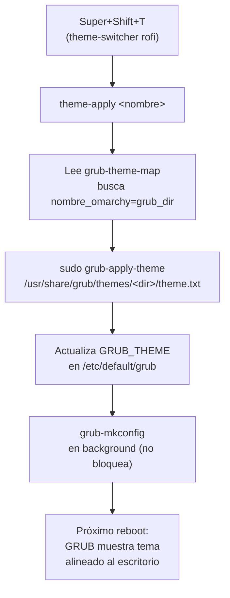

← [Cap. 06 — Configuración de Snapper](Capítulo-06-Configuración-de-Snapper.md) · [Índice](..) · [Cap. 08 — mkinitcpio](Capítulo-08-mkinitcpio.md) →

---

En este capítulo instalamos y configuramos GRUB. Al finalizar, el gestor de arranque estará activo en la partición EFI y el daemon `grub-btrfsd` actualizará el menú de GRUB automáticamente cada vez que snapper cree o elimine un snapshot.

> Todos los comandos de este capítulo se ejecutan **dentro del chroot**.

---

## 1. Verificar el punto de montaje EFI

Confirma que la partición EFI está montada en `/efi`:

```bash
findmnt /efi
```

Resultado esperado:

```text
TARGET  SOURCE         FSTYPE  OPTIONS
/efi    /dev/nvme0n1p1 vfat    rw,relatime,...
```

Si no está montada, monta antes de continuar:

```bash
mount /dev/nvme0n1p1 /efi
```

---

## 2. Instalar GRUB en la partición EFI

```bash
grub-install --target=x86_64-efi --efi-directory=/efi --bootloader-id=CachyOS
```

Resultado esperado:

```text
Installing for x86_64-efi platform.
Installation finished. No error reported.
```

---

## 3. Configurar /etc/default/grub

### 3.1 Nombre del distribuidor

El paquete `grub` de Arch tiene `GRUB_DISTRIBUTOR="Arch"` por defecto. Cámbialo a "CachyOS" para que el menú principal muestre el nombre correcto:

```bash
sed -i 's/^GRUB_DISTRIBUTOR=.*/GRUB_DISTRIBUTOR="CachyOS"/' /etc/default/grub
```

Verifica:

```bash
grep GRUB_DISTRIBUTOR /etc/default/grub
```

Resultado esperado:

```text
GRUB_DISTRIBUTOR="CachyOS"
```

### 3.2 Timeout y estilo del menú

Verifica el valor actual de `GRUB_TIMEOUT_STYLE`:

```bash
grep GRUB_TIMEOUT /etc/default/grub
```

El valor `hidden` oculta el menú de GRUB al arrancar, lo que impide seleccionar snapshots. Si aparece `hidden`, cámbialo a `menu`:

```bash
sed -i 's/GRUB_TIMEOUT_STYLE=hidden/GRUB_TIMEOUT_STYLE=menu/' /etc/default/grub
```

Si ya dice `menu`, el comando no cambia nada — es seguro ejecutarlo en cualquier caso.

Verifica el resultado final:

```bash
grep GRUB_TIMEOUT /etc/default/grub
```

Resultado esperado:

```text
GRUB_TIMEOUT=5
GRUB_TIMEOUT_STYLE=menu
```

### 3.3 Modo gráfico

Sin modo gráfico, GRUB muestra texto VGA a 80×25 caracteres. Con `gfxterm` activo, el menú utiliza la resolución nativa del display y permite themes, fuentes y la transición sin parpadeo hacia Plymouth.

Instala el tema gráfico de CachyOS:

```bash
pacman -S --noconfirm cachyos-grub-theme
```

Activa el modo gráfico con los siguientes parámetros. `GRUB_FONT` debe declararse explícitamente — sin él, `gfxterm` no carga la fuente y GRUB vuelve al modo texto en silencio aunque el resto de la configuración sea correcta:

| Parámetro | Valor | Efecto |
|---|---|---|
| `GRUB_GFXMODE` | `auto` | GRUB detecta la resolución nativa del display vía UEFI GOP |
| `GRUB_GFXPAYLOAD_LINUX` | `keep` | Mantiene el modo gráfico al pasar el control al kernel — evita el parpadeo antes de Plymouth |
| `GRUB_TERMINAL_OUTPUT` | `gfxterm` | Activa el terminal gráfico de GRUB en lugar del texto VGA |
| `GRUB_FONT` | `/boot/grub/fonts/unicode.pf2` | Fuente requerida por `gfxterm` — sin este parámetro el modo gráfico no se activa |
| `GRUB_THEME` | `/usr/share/grub/themes/cachyos/theme.txt` | Aplica el tema visual de CachyOS |

```bash
sed -i 's/^#\?GRUB_GFXMODE=.*/GRUB_GFXMODE=auto/' /etc/default/grub
```

```bash
grep -q "^GRUB_GFXPAYLOAD_LINUX" /etc/default/grub \
    && sed -i 's/^#\?GRUB_GFXPAYLOAD_LINUX=.*/GRUB_GFXPAYLOAD_LINUX=keep/' /etc/default/grub \
    || echo 'GRUB_GFXPAYLOAD_LINUX=keep' >> /etc/default/grub
```

```bash
grep -q "^GRUB_TERMINAL_OUTPUT" /etc/default/grub \
    && sed -i 's/^#\?GRUB_TERMINAL_OUTPUT=.*/GRUB_TERMINAL_OUTPUT=gfxterm/' /etc/default/grub \
    || echo 'GRUB_TERMINAL_OUTPUT=gfxterm' >> /etc/default/grub
```

```bash
grep -q "^GRUB_FONT" /etc/default/grub \
    && sed -i 's|^#\?GRUB_FONT=.*|GRUB_FONT=/boot/grub/fonts/unicode.pf2|' /etc/default/grub \
    || echo 'GRUB_FONT=/boot/grub/fonts/unicode.pf2' >> /etc/default/grub
```

```bash
grep -q "^GRUB_THEME" /etc/default/grub \
    && sed -i 's|^#\?GRUB_THEME=.*|GRUB_THEME=/usr/share/grub/themes/cachyos/theme.txt|' /etc/default/grub \
    || echo 'GRUB_THEME=/usr/share/grub/themes/cachyos/theme.txt' >> /etc/default/grub
```

Verifica los cinco parámetros:

```bash
grep -E "^GRUB_GFXMODE|^GRUB_GFXPAYLOAD|^GRUB_TERMINAL_OUTPUT|^GRUB_FONT|^GRUB_THEME" /etc/default/grub
```

Resultado esperado:

```text
GRUB_GFXMODE=auto
GRUB_GFXPAYLOAD_LINUX=keep
GRUB_TERMINAL_OUTPUT=gfxterm
GRUB_FONT=/boot/grub/fonts/unicode.pf2
GRUB_THEME=/usr/share/grub/themes/cachyos/theme.txt
```

---

## 4. Configurar grub-btrfs

`grub-btrfs` tiene su propio archivo de configuración independiente de `/etc/default/grub`. Aquí se define el nombre del submenú de snapshots que aparece en GRUB.

Cambia el nombre del submenú de "Arch Linux Snapshots" a "CachyOS Snapshots":

```bash
sed -i 's/^#\?GRUB_BTRFS_SUBMENUNAME=.*/GRUB_BTRFS_SUBMENUNAME="CachyOS Snapshots"/' /etc/default/grub-btrfs/config
```

Verifica:

```bash
grep GRUB_BTRFS_SUBMENUNAME /etc/default/grub-btrfs/config
```

Resultado esperado:

```text
GRUB_BTRFS_SUBMENUNAME="CachyOS Snapshots"
```

---

## 5. Habilitar el daemon grub-btrfsd

`grub-btrfsd` monitorea `/.snapshots` con inotify y regenera las entradas de snapshots en el menú de GRUB automáticamente cada vez que snapper crea o elimina uno. Requiere `inotify-tools`, instalado en el Capítulo 3.

```bash
systemctl enable grub-btrfsd
```

Resultado esperado:

```text
Created symlink /etc/systemd/system/multi-user.target.wants/grub-btrfsd.service → /usr/lib/systemd/system/grub-btrfsd.service
```

Verifica:

```bash
systemctl is-enabled grub-btrfsd
```

Resultado esperado:

```text
enabled
```

---

## 6. Generar el archivo de configuración de GRUB

```bash
grub-mkconfig -o /boot/grub/grub.cfg
```

Resultado esperado (extracto):

```text
Generating grub configuration file ...
Found linux image: /boot/vmlinuz-linux-cachyos
Found initrd image: /boot/initramfs-linux-cachyos.img
done
```

> Es normal que `grub-btrfs` no liste snapshots en este momento — el daemon `grub-btrfsd` los agregará al menú automáticamente una vez que el sistema esté corriendo y existan snapshots en `/.snapshots`. Los snapshots son visibles en GRUB a partir del **segundo arranque**.

---

## 7. Verificación final

Confirma que el archivo EFI de GRUB fue instalado:

```bash
ls /efi/EFI/CachyOS/
```

Confirma que `grub.cfg` fue generado:

```bash
ls -la /boot/grub/grub.cfg
```

Confirma que `grub-btrfsd` está habilitado:

```bash
systemctl is-enabled grub-btrfsd
```

Resultado esperado:

```text
enabled
```

Confirma el nombre del submenú de snapshots:

```bash
grep GRUB_BTRFS_SUBMENUNAME /etc/default/grub-btrfs/config
```

Resultado esperado:

```text
GRUB_BTRFS_SUBMENUNAME="CachyOS Snapshots"
```

Confirma el modo gráfico:

```bash
grep -E "^GRUB_GFXMODE|^GRUB_GFXPAYLOAD|^GRUB_TERMINAL_OUTPUT|^GRUB_FONT|^GRUB_THEME" /etc/default/grub
```

Resultado esperado:

```text
GRUB_GFXMODE=auto
GRUB_GFXPAYLOAD_LINUX=keep
GRUB_TERMINAL_OUTPUT=gfxterm
GRUB_FONT=/boot/grub/fonts/unicode.pf2
GRUB_THEME=/usr/share/grub/themes/cachyos/theme.txt
```

---

## 8. Colección de temas GRUB (post-instalación)

> Esta sección aplica **después** de completar el escritorio Hyprland (Capítulo 12).
> El script `install-cachyos-hyprland.sh` instala todo automáticamente; aquí se documenta para referencia.

Se instalan 10 temas en `/usr/share/grub/themes/`:

| Tema | Repo | Familia visual |
|---|---|---|
| `catppuccin-mocha-grub-theme` | catppuccin/grub | Oscuro — tonos azul/lavanda |
| `catppuccin-latte-grub-theme` | catppuccin/grub | Claro — beige/azul |
| `catppuccin-frappe-grub-theme` | catppuccin/grub | Medio — gris/lavanda |
| `catppuccin-macchiato-grub-theme` | catppuccin/grub | Oscuro medio — teal/azul |
| `gruvbox` | x4121/grub-gruvbox | Retro — tierra/dorado |
| `dracula` | dracula/grub | Oscuro — púrpura/verde |
| `nord` | jlempen/grub2-theme-arch-nord | Frío — azul ártico |
| `tela` | vinceliuice/grub2-themes | Moderno — minimalista |
| `stylish` | vinceliuice/grub2-themes | Elegante — fondos oscuros |
| `starfield` | GRUB incorporado | Astronómico |

> **Nota sobre vinceliuice:** los temas `tela` y `stylish` instalan en `/boot/grub/themes/` (comportamiento del instalador upstream). El script los copia a `/usr/share/grub/themes/` como paso adicional.

### GRUB Theme Switcher (manual)

Para cambiar el tema del GRUB desde la sesión activa (sin reiniciar):

```bash
~/.local/bin/grub-theme-switcher
```

El script usa `rofi` para listar los temas disponibles en `/usr/share/grub/themes/`. Al seleccionar uno, ejecuta `/usr/local/bin/grub-apply-theme` (con `sudo NOPASSWD`) que actualiza `GRUB_THEME` en `/etc/default/grub` y regenera `grub.cfg`. El nuevo tema es visible en el **próximo arranque**.

Verificar el tema activo:

```bash
grep ^GRUB_THEME /etc/default/grub
```

---

## 9. Theming dinámico con omarchy (Super+Shift+T)

> Requiere: desktop Hyprland instalado (Capítulo 12), colección de temas GRUB (sección 8 arriba).

Al cambiar de tema de escritorio con `Super+Shift+T`, `theme-apply` sincroniza automáticamente el tema de GRUB. El mapeo entre temas de escritorio y temas GRUB se define en:

```
~/.local/share/omarchy-local/grub-theme-map
```

Formato: `nombre_omarchy=directorio_en_/usr/share/grub/themes/`

### Mapeo completo (21 temas omarchy → 10 temas GRUB)

| Tema omarchy | Tema GRUB |
|---|---|
| catppuccin | catppuccin-mocha-grub-theme |
| catppuccin-latte | catppuccin-latte-grub-theme |
| ethereal | catppuccin-macchiato-grub-theme |
| everforest | gruvbox |
| flexoki-light | catppuccin-latte-grub-theme |
| gruvbox | gruvbox |
| hackerman | stylish |
| kanagawa | catppuccin-mocha-grub-theme |
| last-horizon | tela |
| lumon | catppuccin-latte-grub-theme |
| matte-black | stylish |
| miasma | catppuccin-mocha-grub-theme |
| nord | nord |
| osaka-jade | catppuccin-macchiato-grub-theme |
| retro-82 | dracula |
| ristretto | catppuccin-frappe-grub-theme |
| rose-pine | dracula |
| solitude | catppuccin-latte-grub-theme |
| tokyo-night | catppuccin-mocha-grub-theme |
| vantablack | stylish |
| white | catppuccin-latte-grub-theme |

### Flujo completo



### Comportamiento

- `grub-apply-theme` corre en **background** (`&`) — no bloquea el cambio visual del escritorio.
- El tema GRUB usa NOPASSWD vía `/etc/sudoers.d/grub-theme-switcher` — solo ese binario específico.
- Si el tema omarchy no tiene entrada en el mapa, usa el `default` (catppuccin-mocha).
- El efecto es visible solo en el **próximo arranque** — GRUB no recarga en caliente.

### Validación

```bash
grep ^GRUB_THEME /etc/default/grub
```

```text
GRUB_THEME="/usr/share/grub/themes/gruvbox/theme.txt"
```

---

## Estado esperado al final del capítulo

Al terminar este capítulo (fase instalación):

- GRUB está instalado en la partición EFI con el identificador `CachyOS`.
- El menú de GRUB muestra "CachyOS" como nombre del sistema.
- El submenú de snapshots se llama "CachyOS Snapshots".
- El menú de GRUB se muestra durante el arranque con un timeout de 5 segundos.
- El modo gráfico `gfxterm` está activo con resolución `auto`, fuente `unicode.pf2` y `GRUB_GFXPAYLOAD_LINUX=keep`.
- El tema visual `catppuccin-mocha-grub-theme` está configurado por defecto.
- `grub-btrfsd` está habilitado y actualizará el menú automáticamente al crearse nuevos snapshots.
- El archivo `/boot/grub/grub.cfg` fue generado.

Post-instalación del escritorio (secciones 8-9):

- 10 temas GRUB instalados en `/usr/share/grub/themes/`.
- `grub-theme-switcher` disponible desde rofi para cambio manual.
- `theme-apply` sincroniza el tema GRUB automáticamente con Super+Shift+T.

El siguiente capítulo configura `mkinitcpio` con el hook `btrfs` para que el initramfs soporte correctamente el sistema de archivos raíz BTRFS.

---

← [Cap. 06 — Configuración de Snapper](Capítulo-06-Configuración-de-Snapper.md) · [Índice](..) · [Cap. 08 — mkinitcpio](Capítulo-08-mkinitcpio.md) →
