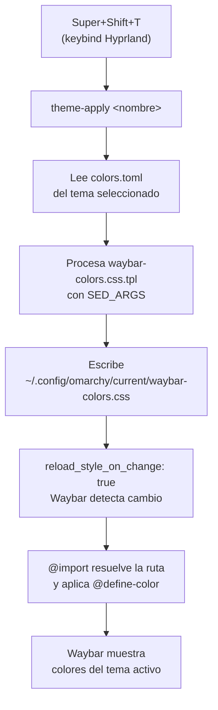

← [Cap. 12 — Instalación Hyprland](Capítulo-12-Instalacion-Hyprland.md) · [Índice](..) · [Cap. 14 — Uso de Hyprland](Capítulo-14-Uso-Hyprland.md) →

---

## Introducción

Waybar es la barra de estado del escritorio Hyprland. La configuración aquí descrita reemplaza la barra por defecto con un diseño inspirado en omarchy, usando el tema de colores **Catppuccin Mocha** y la fuente **JetBrainsMono Nerd Font**.

La personalización del escritorio se gestiona con un script separado del script de instalación base:

| Script | Responsabilidad |
|---|---|
| `install-cachyos-hyprland.sh` | Sistema base: paquetes, SDDM, servicios |
| `install-hyprland-desktop.sh` | Escritorio: waybar, rofi, temas, fuentes, audio |

---

## Prerequisitos

```bash
bash install-hyprland-desktop.sh
```

El script verifica que `waybar`, `rofi` e `hyprctl` estén disponibles antes de ejecutarse.

---

## Estructura de la configuración

Los archivos de configuración se ubican en:

```
~/.config/waybar/
├── config.jsonc   # Módulos y comportamiento
└── style.css      # Colores y estilos visuales
```

### Layout de la barra

```
[ 󰣇  1  2  3  4  5 ]   [ Martes 14:30 ]   [ 󰂱  󰕾  󰃠  󰍛  󰁹 ]
  izquierda                  centro                  derecha
```

| Zona | Módulos |
|---|---|
| Izquierda | Lanzador de apps + workspaces |
| Centro | Reloj (día y hora) |
| Derecha | bluetooth, audio, brillo, CPU, batería, tray |

---

## Módulos

### Lanzador de apps (`custom/launcher`)

Ícono `󰣇` en la esquina izquierda. Abre rofi al hacer clic, y la terminal (`alacritty`) con clic derecho.

```jsonc
"custom/launcher": {
  "format": "󰣇",
  "on-click": "uwsm app -- rofi -show drun",
  "on-click-right": "uwsm app -- alacritty",
  "tooltip-format": "Lanzador  Super+Space\nTerminal  Clic derecho"
}
```

### Workspaces (`hyprland/workspaces`)

Muestra 5 workspaces persistentes numerados del 1 al 5. El workspace activo usa el ícono `󱓻`.

```jsonc
"persistent-workspaces": {
  "1": [], "2": [], "3": [], "4": [], "5": []
}
```

### Reloj (`clock`)

Clic izquierdo muestra hora y día. Clic izquierdo nuevamente alterna a fecha completa con semana del año.

```jsonc
"format":     "{:L%A %H:%M}",
"format-alt": "{:L%d %B W%V %Y}"
```

### CPU (`cpu`)

Ícono `󰍛`. Clic abre `btop` en una terminal.

### Batería (`battery`)

Íconos progresivos según nivel de carga. Cambia de color al llegar a advertencia (20%) y crítico (10%).

### Audio (`pulseaudio`)

Íconos: `󰕿` bajo · `󰖀` medio · `󰕾` alto · `󰖁` silenciado.

- Rueda del ratón: sube/baja volumen
- Clic izquierdo: abre `pavucontrol` (GUI)
- Clic derecho: silencia/activa con `pamixer`

```jsonc
"pulseaudio": {
  "format": "{icon}",
  "on-click": "uwsm app -- pavucontrol",
  "on-click-right": "pamixer -t",
  "scroll-step": 5,
  "format-muted": "󰖁",
  "format-icons": {
    "headphone": "󰋋",
    "headset": "󰋎",
    "default": ["󰕿", "󰖀", "󰕾"]
  }
}
```

> Los íconos deben ser caracteres Unicode reales de Nerd Fonts, no strings vacíos. Si el ícono no aparece, verificar con `xxd` que los bytes sean secuencias `f3 b0 ...` de 4 bytes.

### Bluetooth (`bluetooth`)

Ícono `󰂱` conectado · `󰂲` apagado. Clic abre `blueman-manager`.

Requiere `bluetooth.service` activo:

```bash
sudo systemctl enable --now bluetooth.service
```

### Brillo (`backlight`)

Íconos progresivos `󰃞 󰃟 󰃠`. Rueda del ratón sube/baja brillo. Dispositivo: `intel_backlight`.

```jsonc
"backlight": {
  "device": "intel_backlight",
  "format": "{icon}",
  "format-icons": ["󰃞", "󰃟", "󰃠"],
  "scroll-step": 5,
  "tooltip-format": "Brillo: {percent}%"
}
```

### Tray (`tray`)

Bandeja del sistema. Los íconos de las apps se muestran con tamaño 12px. Debe ir al **final** de `modules-right` para que quede en el extremo derecho.

---

## Theming dinámico con omarchy

Waybar no lleva colores hardcodeados en `style.css`. En su lugar, la línea 1 importa
un archivo CSS generado automáticamente por `theme-apply` al cambiar de tema:

```css
@import "/home/usuario/.config/omarchy/current/waybar-colors.css";
```

`theme-apply` lee `colors.toml` del tema activo, procesa el template
`~/.local/share/omarchy-local/themed/waybar-colors.css.tpl` y escribe el resultado en
`~/.config/omarchy/current/waybar-colors.css`. Con `reload_style_on_change: true` en
`config.jsonc`, Waybar detecta el cambio y aplica los nuevos colores automáticamente.

### Mapeo de variables (template → CSS)

| Variable CSS en `style.css` | Campo en `colors.toml` |
|---|---|
| `@foreground` | `foreground` |
| `@background` | `mantle` |
| `@surface` | `background` |
| `@accent` | `accent` |
| `@warning` | `color1` |
| `@critical` | `color1` |

### Flujo completo



### Advertencia crítica — `@import url(\"file://...\")` no funciona en Waybar

Waybar preprocesa los imports con su propia función `replaceImports()` (en
`src/util/css_reload_helper.cpp`), que trata el esquema `file://` como una ruta
**relativa** y la concatena a sus directorios de búsqueda:

```
[debug] Try expanding: $HOME/.config/waybar/file:///home/usuario/.config/omarchy/...
[debug] Try expanding: /etc/xdg/waybar/file:///home/usuario/.config/omarchy/...
```

Ninguna de esas rutas existe, el import es **descartado silenciosamente** y todos los
`@define-color` quedan indefinidos. El GTK theme global (catppuccin-mocha-mauve) llena
el vacío con sus propios colores fijos — exactamente lo que se ve cuando el theming no funciona.

**Regla:** usar **siempre** ruta absoluta plana entre comillas, sin `url()` ni `file://`.

### Validación

```bash
WAYLAND_DISPLAY=wayland-1 waybar -l debug 2>&1 | grep -iE "expanding|import|css" | head -20
```

Resultado correcto (ruta limpia, sin `file://`):

```
[debug] Parsing imports for file: /home/usuario/.config/waybar/style.css
[debug] Adding file to watch list: /home/usuario/.config/omarchy/current/waybar-colors.css
[debug] Adding file to watch list: /home/usuario/.config/waybar/style.css
```

---

## Fuente

La barra usa **JetBrainsMono Nerd Font** para renderizar tanto el texto como los íconos Unicode de Nerd Fonts.

```bash
sudo pacman -S --needed ttf-jetbrains-mono-nerd
fc-list | grep -i jetbrains
```

Sin esta fuente, los íconos (`󰣇`, `󱓻`, `󰍛`, etc.) se muestran como cuadros vacíos.

---

## Audio

### Firmware Intel SOF

Los laptops con procesadores Intel Tiger Lake, Alder Lake o más recientes usan el driver SOF (Sound Open Firmware). Sin el paquete `sof-firmware`, el kernel no ve ninguna tarjeta de sonido:

```
/proc/asound/cards → no soundcards
journalctl -b -k: SOF firmware and/or topology file not found
```

```bash
sudo pacman -S --needed sof-firmware
```

Requiere reinicio para que el kernel cargue el firmware.

### PipeWire y PulseAudio

CachyOS usa PipeWire como servidor de audio. Para compatibilidad con aplicaciones PulseAudio (pavucontrol, waybar):

```bash
sudo pacman -S --needed pipewire-pulse pamixer
systemctl --user enable --now pipewire-pulse.service
```

Verificar que el sink del speaker esté activo:

```bash
pactl list sinks short
```

La salida debe mostrar `HiFi__Speaker__sink` en estado `RUNNING` o `SUSPENDED` (no `auto_null`).

---

## SwayOSD — indicador visual de volumen y brillo

`swayosd` muestra un overlay en pantalla al subir/bajar volumen o brillo con las teclas del teclado.

```bash
sudo pacman -S --needed swayosd
```

Se agrega al autostart de `~/.config/hypr/hyprland.lua`:

```lua
hl.exec_cmd("uwsm app -- swayosd-server")
```

Los bindings de volumen deben usar `swayosd-client` en lugar de `wpctl`:

```lua
hl.bind("XF86AudioRaiseVolume", hl.dsp.exec_cmd("swayosd-client --output-volume raise"),           { locked = true, repeating = true })
hl.bind("XF86AudioLowerVolume", hl.dsp.exec_cmd("swayosd-client --output-volume lower"),           { locked = true, repeating = true })
hl.bind("XF86AudioMute",        hl.dsp.exec_cmd("swayosd-client --output-volume mute-toggle"),     { locked = true, repeating = true })
```

---

## NetworkManager Applet

El ícono de red en waybar muestra el estado de la conexión pero no permite seleccionar otras redes WiFi. Para eso se necesita `nm-applet`, que aparece en el tray del sistema y abre el gestor de redes al hacer clic.

```bash
sudo pacman -S --needed network-manager-applet
```

Se agrega al autostart de `~/.config/hypr/hyprland.lua`:

```lua
hl.exec_cmd("uwsm app -- nm-applet --indicator")
```

Con `--indicator` se integra al tray de waybar. El script `install-hyprland-desktop.sh` instala el paquete y agrega la línea automáticamente.

---

## Recargar waybar

Tras modificar cualquier archivo de configuración:

```bash
pkill -x waybar 2>/dev/null; sleep 0.3 && uwsm app -- waybar &
```

> Con `"reload_style_on_change": true` en `config.jsonc`, los cambios en `style.css` se aplican automáticamente sin reiniciar waybar.

---

## Notas SDDM / UWSM

Waybar debe lanzarse siempre con `uwsm app --` para que corra dentro de la sesión gestionada por UWSM. El autostart en `hyprland.lua` ya lo hace así. El comando de recarga manual también debe respetar esta convención.

---

← [Cap. 12 — Instalación Hyprland](Capítulo-12-Instalacion-Hyprland.md) · [Índice](..) · [Cap. 14 — Uso de Hyprland](Capítulo-14-Uso-Hyprland.md) →
