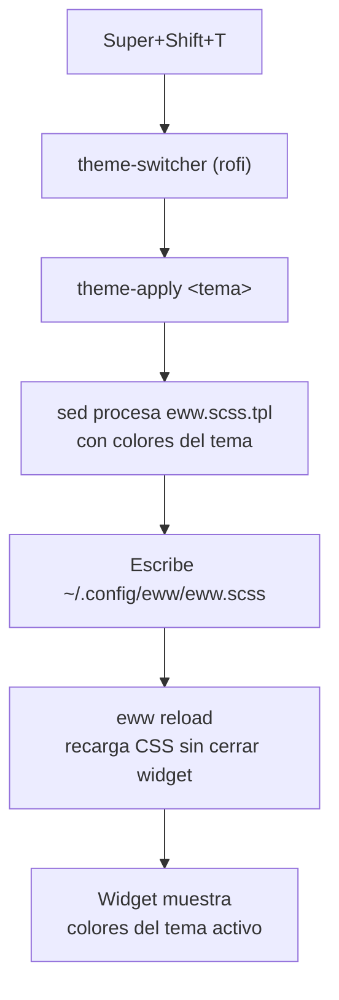

# eww — Wayland Conky

**eww** ("Elkowar's Wacky Widgets") es el equivalente Wayland de Conky: un widget overlay
que muestra información del sistema flotando en el escritorio. Se usa en el setup de
Hyprland como monitor de sistema en tiempo real.

> **Alias mental**: eww = "Wayland Conky" / "Conky Wayland"

## Comandos básicos

```bash
eww open sysmon       # Abrir el widget sysmon
eww kill              # Cerrar el daemon y el widget
eww reload            # Recargar configuración/CSS sin cerrar el widget
eww logs              # Ver errores de compilación SCSS o de datos
eww --version         # Ver versión instalada
```

## Archivos de configuración

| Archivo | Descripción |
|---|---|
| `~/.config/eww/eww.yuck` | Definición de widgets y pollers (datos dinámicos) |
| `~/.config/eww/eww.scss` | Estilos del widget (generado por `theme-apply`) |
| `~/.local/share/omarchy-local/themed/eww.scss.tpl` | Template de estilos para el theming dinámico |

## Theming dinámico con omarchy

`eww.scss` es generado automáticamente por `theme-apply` al cambiar de tema
(Super+Shift+T). El template `eww.scss.tpl` mapea las variables de omarchy al SCSS:

| Variable SCSS | Campo en `colors.toml` | Descripción |
|---|---|---|
| `$base` | `background` | Fondo del widget (con `rgba(..., 0.82)` para transparencia) |
| `$surface0` | `color0` | Fondo de dividers finos |
| `$surface1` | `color8` | Fondo de barras de progreso |
| `$text` | `foreground` | Texto principal (hora, valores) |
| `$accent` | `accent` | Color del reloj (highlight principal) |
| `$section` | `color6` | Etiquetas de sección y barras de progreso |

### Flujo de theming



### Comportamiento del restart en theme-apply

```bash
if pgrep -x eww >/dev/null 2>&1; then
    eww reload 2>/dev/null || true   # recarga en caliente si ya corre
else
    nohup eww open sysmon >/dev/null 2>&1 &  # arranca si no corre
fi
```

Se usa `eww reload` (no kill+restart) para evitar el parpadeo del widget y
problemas de timing al reiniciar el daemon.

## Pollers (scripts de datos)

Los datos del widget son provistos por scripts en `/usr/local/bin/`:

| Script | Intervalo | Datos |
|---|---|---|
| `eww-sysinfo` | 3s | CPU %, temp, frec / RAM / Disco / Red / GPU |
| `eww-net-speed` | 2s | Velocidad upload/download en tiempo real |
| `eww-wan` | 300s | IPs públicas IPv4/IPv6 |

## Autostart en Hyprland

eww arranca automáticamente con la sesión via `hyprland.lua`:

```lua
hl.exec_cmd("uwsm app -- ~/.local/bin/theme-apply")  -- aplica tema al inicio
-- Autostart de eww está en el .desktop de uwsm
```

## Validación del theming

Verificar que eww.scss tiene los colores del tema activo:

```bash
head -6 ~/.config/eww/eww.scss
# Debe mostrar hex del tema activo, NO los valores hardcodeados de catppuccin:
# $base:     #282828;   ← gruvbox
# $accent:   #7daea3;   ← gruvbox
```

Si eww no cambia de colores al aplicar tema, revisar:

```bash
eww logs   # errores de compilación SCSS
cat ~/.config/omarchy/current/theme   # tema activo
```
